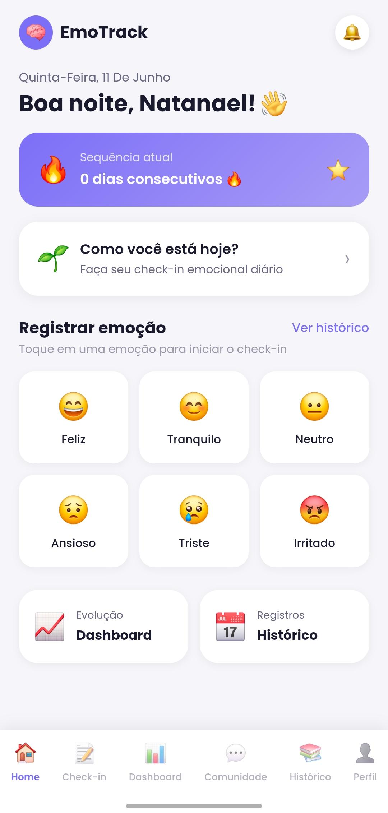
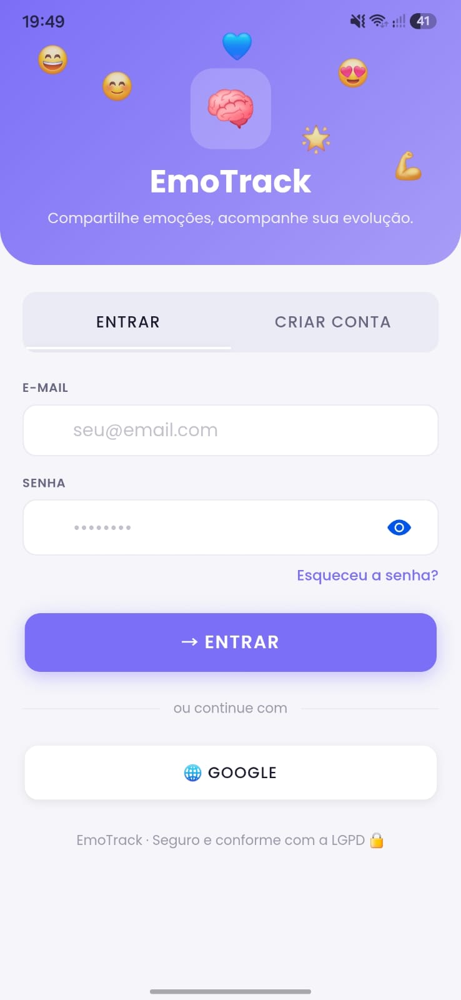
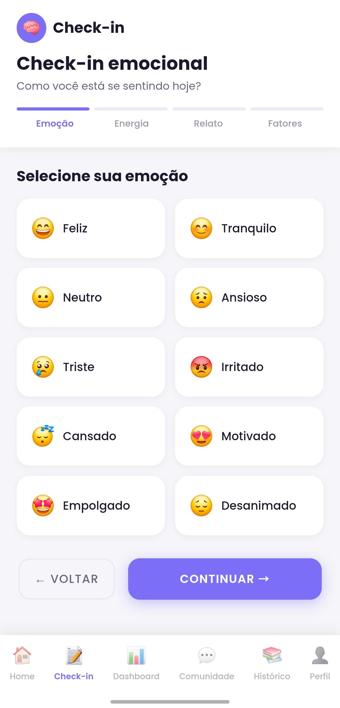
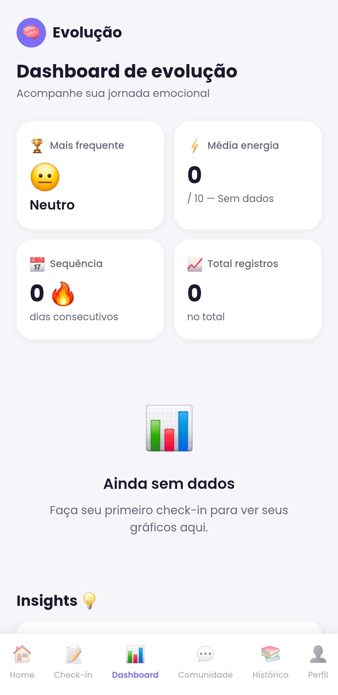
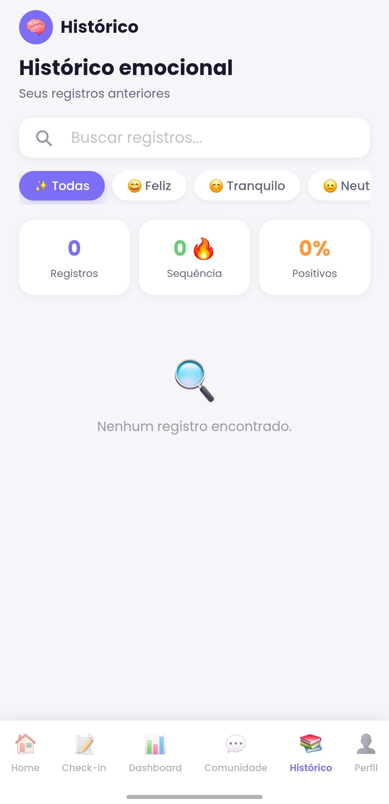
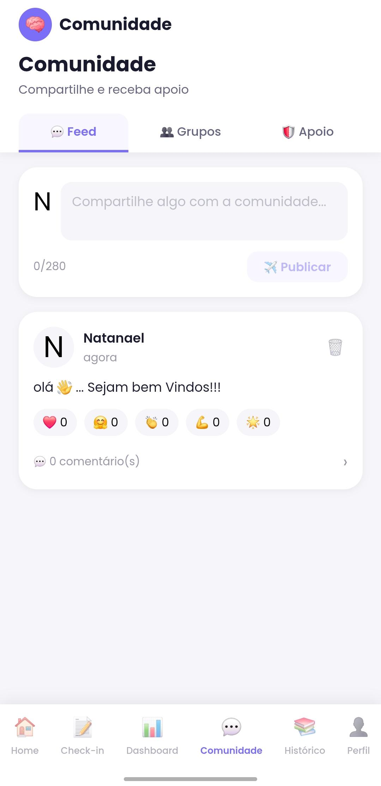
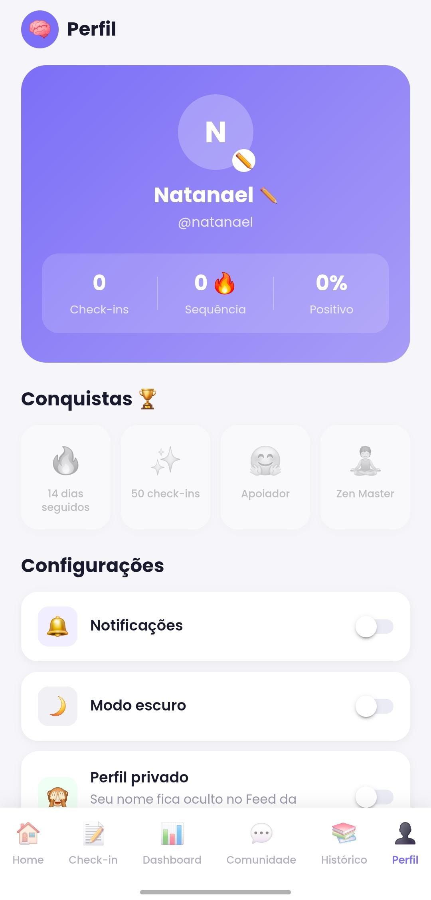

# EmoTrack

**Transformando emoções em autoconhecimento.**

---

## O que é o EmoTrack?

EmoTrack é um aplicativo mobile de **check-in socioemocional** que ajuda pessoas a registrarem suas emoções diárias, acompanharem sua evolução emocional ao longo do tempo e se conectarem com uma comunidade de apoio.

A ideia nasceu da necessidade de ter uma ferramenta simples e acolhedora para quem quer desenvolver mais autoconhecimento — sem julgamentos, sem complexidade.

---

## Funcionalidades

- **Check-in diário** — registre sua emoção, nível de energia, relato livre e fatores que influenciaram seu dia em 4 etapas simples
- **Dashboard** — visualize seus dados emocionais com gráficos, sua sequência de dias, emoção mais frequente e insights automáticos
- **Histórico** — acesse todos os seus registros com filtros por emoção e busca por texto
- **Comunidade** — publique no feed, reaja com emojis em tempo real, participe de grupos temáticos e compartilhe sentimentos anonimamente no espaço de apoio
- **Perfil** — personalize seu avatar, gerencie conquistas e controle sua privacidade
- **Login seguro** — autenticação por e-mail/senha e Google

---

## Telas

| Login | Home | Check-in |
|:---:|:---:|:---:|
|  |  |  |

| Dashboard | Histórico | Comunidade | Perfil |
|:---:|:---:|:---:|:---:|
|  |  |  |  |

---

## Tecnologias utilizadas

| Camada | Tecnologia |
|---|---|
| Framework mobile | Angular + Ionic |
| Backend & banco de dados | Firebase (Auth + Firestore) |
| Build nativo | Capacitor (Android) |
| Gráficos | Chart.js |
| Linguagem | TypeScript |

---

## Contexto

Este projeto foi desenvolvido de forma independente como parte da minha jornada no programa **Ford Enter**, com foco em desenvolvimento mobile e engenharia de software aplicada a saúde mental e bem-estar.

O app está atualmente em **processo de revisão na Google Play Store**.

---

## Sobre mim

Desenvolvedor em formação, apaixonado por criar soluções que geram impacto real na vida das pessoas.

- GitHub: [@Natan20](https://github.com/Natan20)

